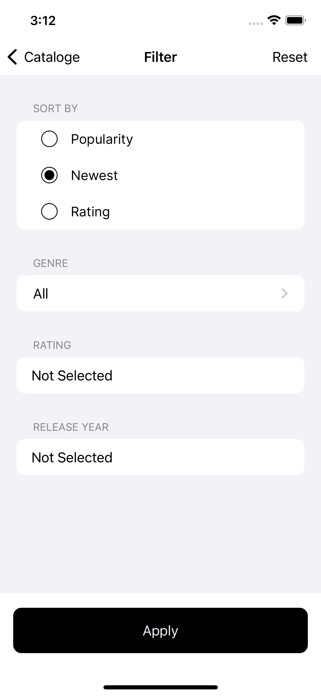

# See

<!-- Project Settings -->

 

<!-- Main Screenshot -->

<!-- Project bref -->
iOS Application (similar to Netflix but different in UI design) based on MVVM.

> I was trying to simulate [Merlan Serkaliyev](https://www.behance.net/gallery/152224209/See-Online-Cinema-App?tracking_source=search_projects%7Cmovie+app) design for learning purposes only. I used Figma to create app logo and icons like the Design.

> This app is a result of me finishing iOS Networking With Swift Course.

 

<!-- ____________________________________________________________________________ -->
## Table of Contents
 - [Features](#features)
 - [Technologies](#technologies)
 - [Demo Video](#demo-video)
 - [Screenshot](#screenshot)

<!-- ____________________________________________________________________________ -->
## Features
- Show Trending, Popular, Revenue, Primary and Top Rated Movies and TV Shows
- Show a preview of the Movie or TV Show
- Show trailer of the Movie or TV Show
- Show the Cast of the Movie or TV Show
- Show a similar Movie or TV Show for a specific movie or tv show
- Show Favorite Movies and TV Shows
- Show Watch list Movies and TV Shows
- Adding Movie and TV Show to his Favorits list
- Adding Movie and TV Show to his Watch list
- Rating Movie and TV Show
- Share a link to the Movie or TV Show
- Search for Movies and/or TV Shows
- Filter Movies and TV Shows:
    - By most Popular or Newest or Rated
    - By Genre
    - By Rating value
    - By Release Date
- Login via the App
- Loagin via the Website and redirect to the app
- Signup via the Website

<!-- ____________________________________________________________________________ -->
## Technologies
- [TMDB API](https://www.themoviedb.org/)
- [Youtube API](https://developers.google.com/youtube/v3)
- URLSession with Modern Concurrency
- NSCache
- Strategy Design Pattern
- Delegate Desgin Pattern
- Singleton Design Pattern
- NotificationCenter
- userDefaults
- NWPathMonitor

### Interface
- WebKit
- Compositional Layout
- CAGradientLayer
- [UIPagingCollectionView](https://github.com/Mohamed-Khaterr/UIPagingCollectionView)
- [Custom Font](https://fonts.google.com/specimen/Inter?query=inter)

<!-- ____________________________________________________________________________ -->
## Demo Video

> Click on the image to show the demo video

<!-- Video Link -->
<a href="https://youtu.be/KP760vleETU">
    <!-- Video Image -->
    
</a>

<!-- ____________________________________________________________________________ -->
## Screenshot

|            |             |            |           |
| ---------- | ----------- | ---------- | --------- |
 |  |  | 
 |  |  | 
 |  |  | 
 |  |  | 
